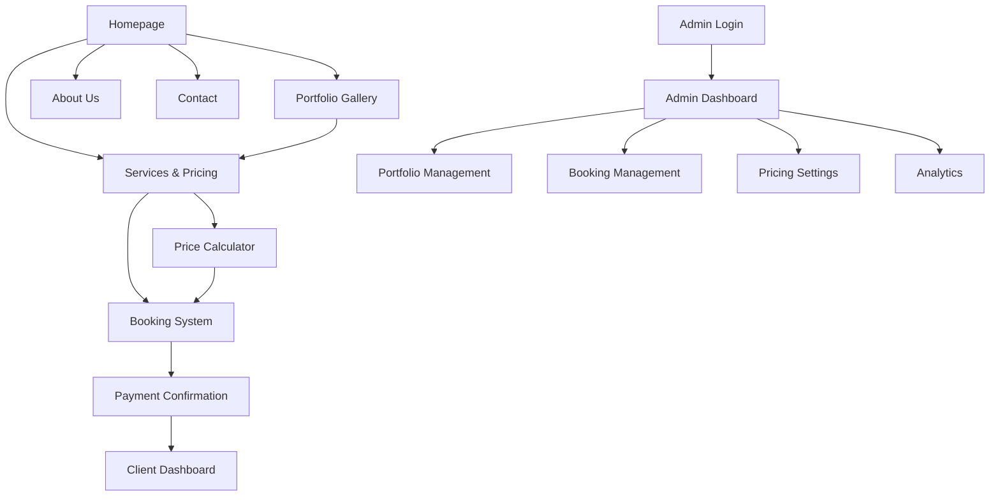

## 1. Product Overview
FRYB Studio is a high-impact photography and videography business website that showcases their event shooting and photo shoot services. The platform features a stunning portfolio showcase with dynamic content management, automated booking system with price calculations, and comprehensive client management tools.

The website targets event organizers, couples, families, and businesses seeking professional photography/videography services, helping them easily browse portfolios, calculate service costs, and book sessions seamlessly.

## 2. Core Features

### 2.1 User Roles
| Role | Registration Method | Core Permissions |
|------|---------------------|------------------|
| Client | Email/Social Media Registration | Browse portfolio, calculate prices, book services, view booking history |
| Admin/Studio Owner | Admin Panel Registration | Full access to portfolio management, booking management, pricing settings, client communications |

### 2.2 Feature Module
Our FRYB Studio website requirements consist of the following main pages:
1. **Homepage**: Hero showcase, service highlights, featured portfolio gallery, client testimonials, quick booking CTA.
2. **Portfolio Gallery**: Dynamic photo/video showcase with categories, filtering, lightbox view, download options.
3. **Services & Pricing**: Service packages, dynamic price calculator, add-on selections, instant quotes.
4. **Booking System**: Calendar availability, service selection, client details, payment integration, confirmation.
5. **About Us**: Studio story, team profiles, equipment showcase, awards/recognition.
6. **Contact & Inquiry**: Contact form, location map, social media links, quick consultation booking.
7. **Client Dashboard**: Booking history, upcoming sessions, photo delivery status, invoice downloads.
8. **Admin Dashboard**: Portfolio management, booking management, client database, analytics dashboard.

### 2.3 Page Details
| Page Name | Module Name | Feature description |
|-----------|-------------|---------------------|
| Homepage | Hero Showcase | Display full-screen rotating gallery of best work with smooth transitions, studio logo overlay, and compelling tagline. |
| Homepage | Service Highlights | Showcase 3-4 main services (weddings, events, portraits, commercial) with stunning visuals and brief descriptions. |
| Homepage | Featured Portfolio | Curated grid of latest/best work with hover effects linking to full gallery. |
| Homepage | Quick Booking CTA | Prominent button leading to booking system with "Book Now" messaging. |
| Portfolio Gallery | Category Filter | Filter by photography type (weddings, events, portraits, commercial, prenup). |
| Portfolio Gallery | Dynamic Gallery Grid | Responsive masonry layout with lazy loading, hover zoom effects, and smooth transitions. |
| Portfolio Gallery | Lightbox Viewer | Full-screen image viewer with navigation, zoom, and social sharing options. |
| Portfolio Gallery | Video Showcase | Embedded video player for videography samples with quality selection. |
| Services & Pricing | Package Cards | Display service packages with pricing, inclusions, and comparison table. |
| Services & Pricing | Price Calculator | Interactive calculator for custom packages with real-time price updates. |
| Services & Pricing | Add-on Selection | Optional services (extra hours, locations, prints, albums) with pricing. |
| Services & Pricing | Instant Quote | Generate and send detailed quotes to client email with booking link. |
| Booking System | Calendar Integration | Show available dates with real-time booking status, block booked dates. |
| Booking System | Service Selection | Step-by-step service selection with visual package comparison. |
| Booking System | Client Information Form | Collect client details, event information, special requirements. |
| Booking System | Payment Processing | Secure payment gateway integration with multiple payment options. |
| Booking System | Confirmation & Receipt | Automated booking confirmation with details, receipt generation. |
| About Us | Studio Story | Compelling narrative about FRYB Studio journey and passion. |
| About Us | Team Profiles | Photographer/videographer profiles with specialties and sample work. |
| About Us | Equipment Showcase | Professional equipment display highlighting technical capabilities. |
| Contact & Inquiry | Contact Form | Multi-field form with service type selection and message area. |
| Contact & Inquiry | Location & Hours | Interactive map with studio location and operating hours. |
| Contact & Inquiry | Quick Consultation | Direct booking link for consultation sessions. |
| Client Dashboard | Booking History | List of all bookings with status, dates, and service details. |
| Client Dashboard | Upcoming Sessions | Calendar view of scheduled shoots with countdown timer. |
| Client Dashboard | Photo Delivery Status | Track photo/video editing progress and delivery timeline. |
| Client Dashboard | Invoice & Contracts | Access to all invoices, contracts, and payment history. |
| Admin Dashboard | Portfolio Management | Upload, categorize, and manage portfolio content with SEO optimization. |
| Admin Dashboard | Booking Management | View, modify, and track all bookings with client communication tools. |
| Admin Dashboard | Pricing Settings | Dynamic pricing configuration with seasonal rates and discounts. |
| Admin Dashboard | Analytics Dashboard | Revenue tracking, booking trends, popular services, client demographics. |

## 3. Core Process

### Client Flow
1. Client lands on homepage with stunning visual showcase
2. Browses portfolio gallery filtered by service type
3. Explores services and uses price calculator for custom quotes
4. Selects preferred date from availability calendar
5. Fills booking form with event details and requirements
6. Receives instant quote and proceeds to payment
7. Gets booking confirmation with next steps
8. Accesses client dashboard to track progress

### Admin Flow
1. Admin logs into secure dashboard
2. Reviews new bookings and client inquiries
3. Manages portfolio content and updates
4. Adjusts pricing and availability settings
5. Communicates with clients through integrated messaging
6. Tracks business analytics and performance metrics
7. Manages photo/video delivery workflow

## 4. User Interface Design

### 4.1 Design Style
- **Primary Colors**: Deep charcoal (#1a1a1a), Crisp white (#ffffff), Accent gold (#d4af37)
- **Secondary Colors**: Warm gray (#6b7280), Soft cream (#fef7ed), Rich black (#0f0f0f)
- **Button Style**: Minimalist with subtle hover effects, rounded corners (8px radius)
- **Typography**: Elegant serif for headings (Playfair Display), Clean sans-serif for body (Inter)
- **Layout Style**: Full-width hero sections, card-based content blocks, generous white space
- **Icon Style**: Thin line icons, monochromatic with gold accents for interactive elements
- **Animation**: Smooth parallax scrolling, subtle fade-ins, elegant hover transitions

### 4.2 Page Design Overview
| Page Name | Module Name | UI Elements |
|-----------|-------------|-------------|
| Homepage | Hero Showcase | Full-screen Ken Burns effect on images, semi-transparent overlay with studio branding, animated text reveal |
| Portfolio Gallery | Gallery Grid | Masonry layout with 3 columns desktop/2 tablet/1 mobile, lazy loading with blur-up effect, hover zoom with overlay text |
| Services & Pricing | Package Cards | Horizontal card layout with feature lists, toggle between package types, prominent CTA buttons |
| Booking System | Calendar Widget | Clean monthly view with available dates highlighted, previous/next month navigation, selected date indicator |
| Admin Dashboard | Analytics Cards | Material Design inspired cards with charts, data tables with sorting, color-coded status indicators |

### 4.3 Responsiveness
- **Desktop-first approach** with breakpoints at 1200px, 768px, and 480px
- **Touch optimization** for gallery navigation and booking forms
- **Mobile-specific features** including swipe gestures for portfolio browsing
- **Progressive Web App** capabilities for offline portfolio viewing

### 4.4 Portfolio Showcase Guidance
- **Environment**: Studio and outdoor settings with professional lighting
- **Mood**: Elegant, sophisticated, emotionally engaging imagery
- **Composition**: Rule of thirds, leading lines, depth of field emphasis
- **Color Grading**: Warm tones for weddings, cool tones for corporate, vibrant for events
- **Loading Strategy**: Progressive image loading with blur-to-sharp transition
- **SEO Optimization**: Alt text, structured data, image compression without quality loss