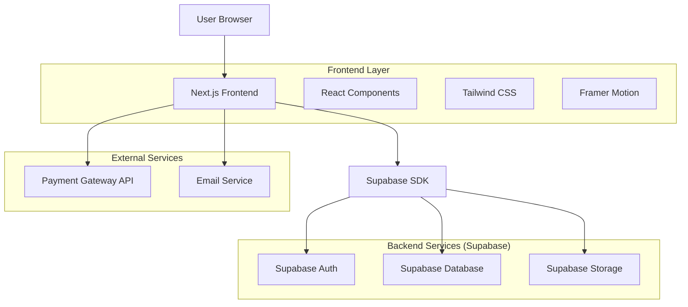
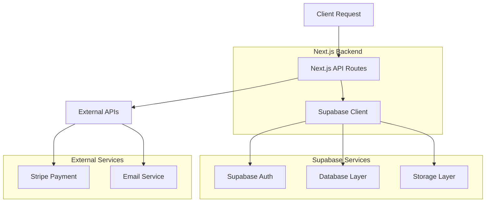
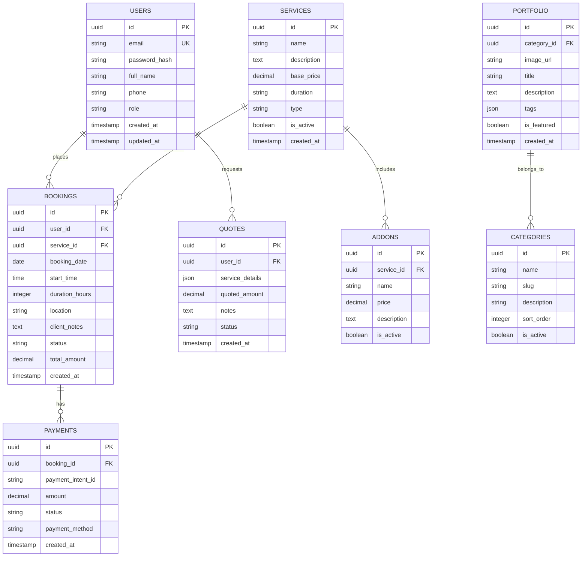

## 1. Architecture design



## 2. Technology Description
- **Frontend**: Next.js 14 + React 18 + TypeScript + Tailwind CSS
- **Initialization Tool**: create-next-app
- **Styling**: Tailwind CSS 3 + Framer Motion for animations
- **UI Components**: shadcn/ui + Radix UI
- **Image Optimization**: Next.js Image component + Cloudinary integration
- **State Management**: React Context + Zustand for complex state
- **Backend**: Supabase (PostgreSQL, Auth, Storage, Real-time)
- **Payment Processing**: Stripe Integration
- **Email Service**: Resend/EmailJS for transactional emails

## 3. Route definitions
| Route | Purpose |
|-------|---------|
| / | Homepage with hero showcase and service highlights |
| /portfolio | Dynamic portfolio gallery with filtering and categories |
| /portfolio/[category] | Category-specific portfolio showcase |
| /services | Service packages and pricing information |
| /booking | Main booking system with calendar and service selection |
| /booking/confirm | Booking confirmation and payment page |
| /about | Studio information and team profiles |
| /contact | Contact form and inquiry page |
| /auth/login | Client authentication page |
| /dashboard | Client dashboard for booking management |
| /admin | Admin dashboard for studio management |
| /admin/portfolio | Portfolio content management |
| /admin/bookings | Booking management interface |
| /admin/pricing | Pricing configuration page |
| /admin/analytics | Business analytics dashboard |

## 4. API definitions

### 4.1 Authentication APIs
```
POST /api/auth/register
```
Request:
| Param Name | Param Type | isRequired | Description |
|------------|------------|-------------|-------------|
| email | string | true | Client email address |
| password | string | true | User password |
| name | string | true | Full name |
| phone | string | false | Contact number |

Response:
```json
{
  "user": {
    "id": "uuid",
    "email": "client@example.com",
    "name": "John Doe"
  },
  "session": "jwt_token"
}
```

### 4.2 Booking APIs
```
POST /api/bookings/create
```
Request:
| Param Name | Param Type | isRequired | Description |
|------------|------------|-------------|-------------|
| service_id | string | true | Selected service package ID |
| date | string | true | Preferred booking date |
| duration | number | true | Session duration in hours |
| location | string | true | Shooting location |
| client_notes | string | false | Special requirements |
| addons | array | false | Selected add-ons |

Response:
```json
{
  "booking_id": "uuid",
  "total_amount": 25000,
  "status": "pending",
  "payment_url": "https://stripe.com/..."
}
```

### 4.3 Portfolio APIs
```
GET /api/portfolio/[category]
```
Response:
```json
{
  "category": "weddings",
  "images": [
    {
      "id": "uuid",
      "url": "https://storage.supabase.co/...",
      "title": "Elegant Wedding Shoot",
      "description": "Beautiful outdoor wedding photography",
      "tags": ["outdoor", "romantic", "golden-hour"]
    }
  ]
}
```

### 4.4 Pricing APIs
```
GET /api/pricing/calculate
```
Request:
| Param Name | Param Type | isRequired | Description |
|------------|------------|-------------|-------------|
| service_type | string | true | Type of service |
| duration | number | true | Hours required |
| location_count | number | false | Number of locations |
| addon_ids | array | false | Selected add-ons |

Response:
```json
{
  "base_price": 15000,
  "addons": [
    {"name": "Extra Location", "price": 3000}
  ],
  "total_price": 18000,
  "discount": 0,
  "final_price": 18000
}
```

## 5. Server architecture diagram



## 6. Data model

### 6.1 Data model definition


### 6.2 Data Definition Language

User Table (users)
```sql
-- create table
CREATE TABLE users (
    id UUID PRIMARY KEY DEFAULT gen_random_uuid(),
    email VARCHAR(255) UNIQUE NOT NULL,
    password_hash VARCHAR(255) NOT NULL,
    full_name VARCHAR(100) NOT NULL,
    phone VARCHAR(20),
    role VARCHAR(20) DEFAULT 'client' CHECK (role IN ('client', 'admin')),
    created_at TIMESTAMP WITH TIME ZONE DEFAULT NOW(),
    updated_at TIMESTAMP WITH TIME ZONE DEFAULT NOW()
);

-- create index
CREATE INDEX idx_users_email ON users(email);
CREATE INDEX idx_users_role ON users(role);

-- RLS policies
ALTER TABLE users ENABLE ROW LEVEL SECURITY;
CREATE POLICY "Users can view own profile" ON users FOR SELECT USING (auth.uid() = id);
CREATE POLICY "Users can update own profile" ON users FOR UPDATE USING (auth.uid() = id);
```

Services Table (services)
```sql
-- create table
CREATE TABLE services (
    id UUID PRIMARY KEY DEFAULT gen_random_uuid(),
    name VARCHAR(100) NOT NULL,
    description TEXT,
    base_price DECIMAL(10,2) NOT NULL,
    duration VARCHAR(50),
    type VARCHAR(50) NOT NULL,
    is_active BOOLEAN DEFAULT true,
    created_at TIMESTAMP WITH TIME ZONE DEFAULT NOW()
);

-- insert sample data
INSERT INTO services (name, description, base_price, duration, type) VALUES
('Wedding Photography', 'Complete wedding day coverage', 25000, '8 hours', 'photography'),
('Event Coverage', 'Corporate and private events', 15000, '4 hours', 'photography'),
('Portrait Session', 'Professional portrait photography', 5000, '2 hours', 'photography'),
('Prenup Shoot', 'Engagement and pre-wedding sessions', 12000, '4 hours', 'photography');

-- grant permissions
GRANT SELECT ON services TO anon;
GRANT ALL ON services TO authenticated;
```

Bookings Table (bookings)
```sql
-- create table
CREATE TABLE bookings (
    id UUID PRIMARY KEY DEFAULT gen_random_uuid(),
    user_id UUID REFERENCES users(id) ON DELETE CASCADE,
    service_id UUID REFERENCES services(id) ON DELETE CASCADE,
    booking_date DATE NOT NULL,
    start_time TIME NOT NULL,
    duration_hours INTEGER NOT NULL,
    location VARCHAR(255) NOT NULL,
    client_notes TEXT,
    status VARCHAR(50) DEFAULT 'pending' CHECK (status IN ('pending', 'confirmed', 'completed', 'cancelled')),
    total_amount DECIMAL(10,2) NOT NULL,
    created_at TIMESTAMP WITH TIME ZONE DEFAULT NOW()
);

-- create indexes
CREATE INDEX idx_bookings_user_id ON bookings(user_id);
CREATE INDEX idx_bookings_date ON bookings(booking_date);
CREATE INDEX idx_bookings_status ON bookings(status);

-- RLS policies
ALTER TABLE bookings ENABLE ROW LEVEL SECURITY;
CREATE POLICY "Users can view own bookings" ON bookings FOR SELECT USING (auth.uid() = user_id);
CREATE POLICY "Users can create bookings" ON bookings FOR INSERT WITH CHECK (auth.uid() = user_id);
CREATE POLICY "Admins can view all bookings" ON bookings FOR SELECT USING (EXISTS (
  SELECT 1 FROM users WHERE id = auth.uid() AND role = 'admin'
));
```

Portfolio Table (portfolio)
```sql
-- create table
CREATE TABLE portfolio (
    id UUID PRIMARY KEY DEFAULT gen_random_uuid(),
    category_id UUID REFERENCES categories(id) ON DELETE CASCADE,
    image_url VARCHAR(500) NOT NULL,
    title VARCHAR(200) NOT NULL,
    description TEXT,
    tags JSONB,
    is_featured BOOLEAN DEFAULT false,
    created_at TIMESTAMP WITH TIME ZONE DEFAULT NOW()
);

-- create indexes
CREATE INDEX idx_portfolio_category ON portfolio(category_id);
CREATE INDEX idx_portfolio_featured ON portfolio(is_featured);
CREATE INDEX idx_portfolio_created ON portfolio(created_at DESC);

-- grant permissions
GRANT SELECT ON portfolio TO anon;
GRANT ALL ON portfolio TO authenticated;
```